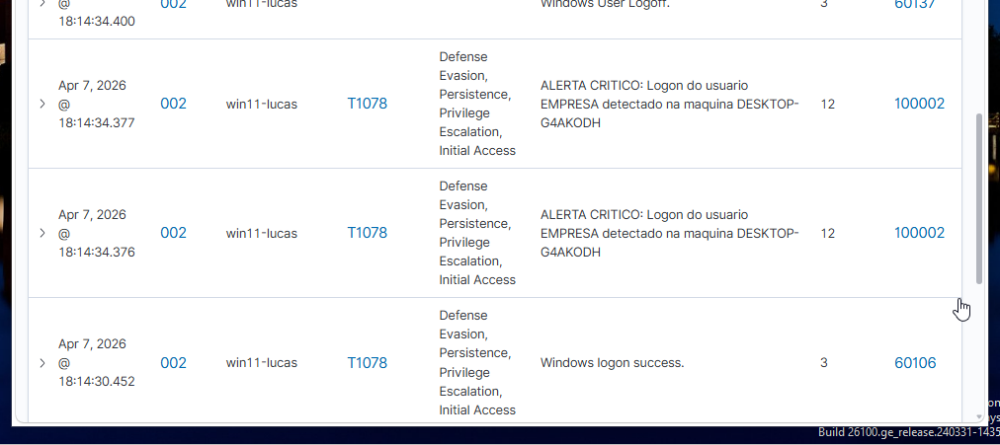

# 🛡️ Blue Team & SOC: Detecção Comportamental e Automação
**Foco:** SIEM (Wazuh), Engenharia de Detecção, Regras Customizadas, Visibilidade e Active Response

## 1. Visão Geral
Este recorte foca na construção da inteligência de defesa do meu laboratório cibernético. Demonstro a configuração de um SIEM moderno (Wazuh) para não apenas monitorar acessos críticos e captar alertas de ataque, mas para agir autonomamente contra ameaças ativas (IPS).

## 2. Engenharia de Detecção (Baseline & Port Scan)
O primeiro passo foi traduzir o comportamento malicioso em lógica de SIEM.

* **Monitoramento de Acessos:** Criação de regra (ID 100002) para mapear acessos de contas sensíveis, garantindo a visibilidade da Linha de Base corporativa. A imagem abaixo valida a detecção bem-sucedida do login do usuário "EMPRESA".
* **Lógica de Port Scan:** Configuração de correlação de eventos de Firewall (ID 100004). O SIEM agrupa bloqueios repetitivos em um intervalo de tempo para classificar a intenção do atacante (MITRE T1046).

## 3. Visibilidade e Monitoramento de Alertas (Ataque vs. Defesa)
Durante as simulações de ataque, o SOC provou sua eficácia capturando os eventos críticos em tempo real. Os vídeos abaixo documentam a ação maliciosa e, em seguida, a visão do painel de monitoramento capturando as anomalias.

* **Detecção de Payload e Acesso Inicial:** O SIEM capturou a exata fração de segundo em que o executável malicioso inicial foi descarregado no disco, além de registrar a telemetria do sistema operando sob ataque.

▶️ **[Assista à simulação e à detecção do Acesso Inicial no SIEM](pictures/ataque1.mp4)**

* **Detecção de LotL (Living off the Land):** Mesmo com o atacante evadindo as assinaturas do antivírus através do uso de comandos nativos do Windows, o monitoramento comportamental não falhou. Identificamos a criação furtiva de usuário (Event ID 4720) e a manipulação do grupo de Administradores (Event ID 4732).

▶️ **[Assista à escalação de privilégios sendo detectada em tempo real](pictures/ataque2.mp4)**

## 4. Automação de Defesa (Active Response)
Para reduzir o MTTR (Mean Time to Respond) a quase zero, implementei um sistema de contenção autônoma.

* **Script Customizado:** Desenvolvimento do script em Batch/PowerShell (`soc-block.cmd`) para extração dinâmica de IOCs (IP do atacante) no JSON de alerta e injeção de regra de bloqueio no Windows Firewall.
* **Gatilho de Ação:** O Wazuh Manager configurado para disparar o bloqueio automaticamente ao identificar um scan de rede agressivo.

▶️ **[Assista à Automação Bloqueando um Port Scan de forma autônoma](pictures/nmap%20bloqueado!.mp4)**