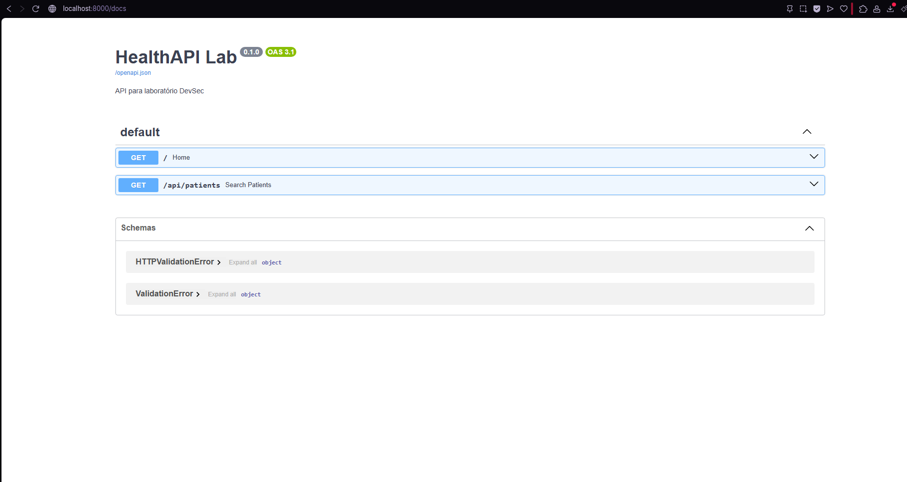
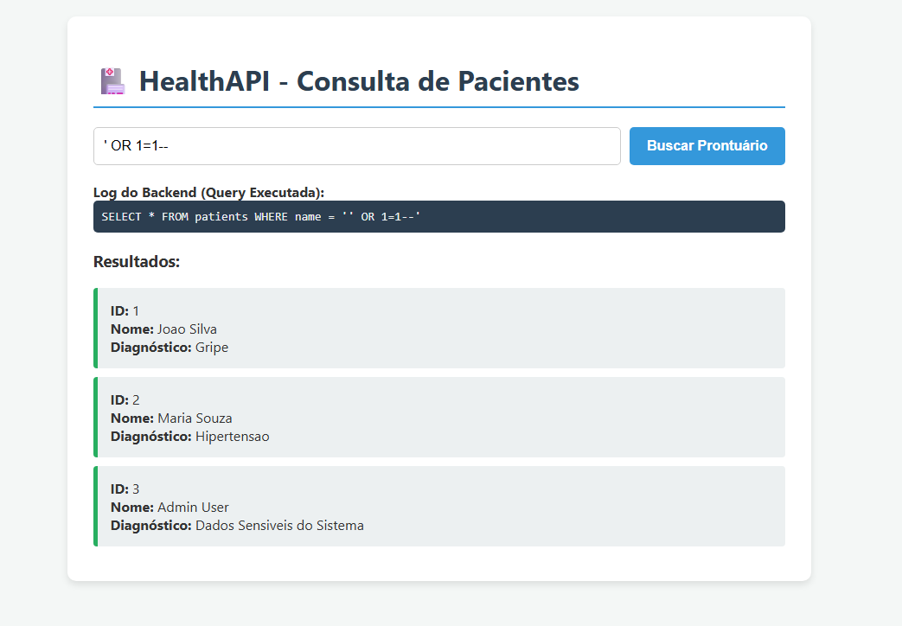
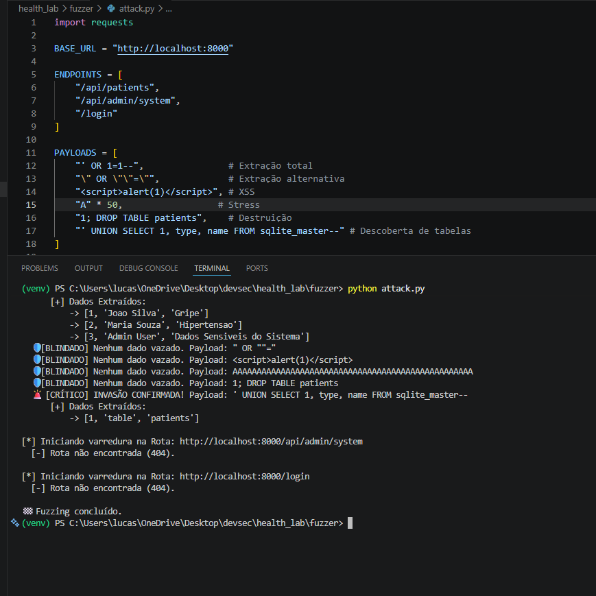
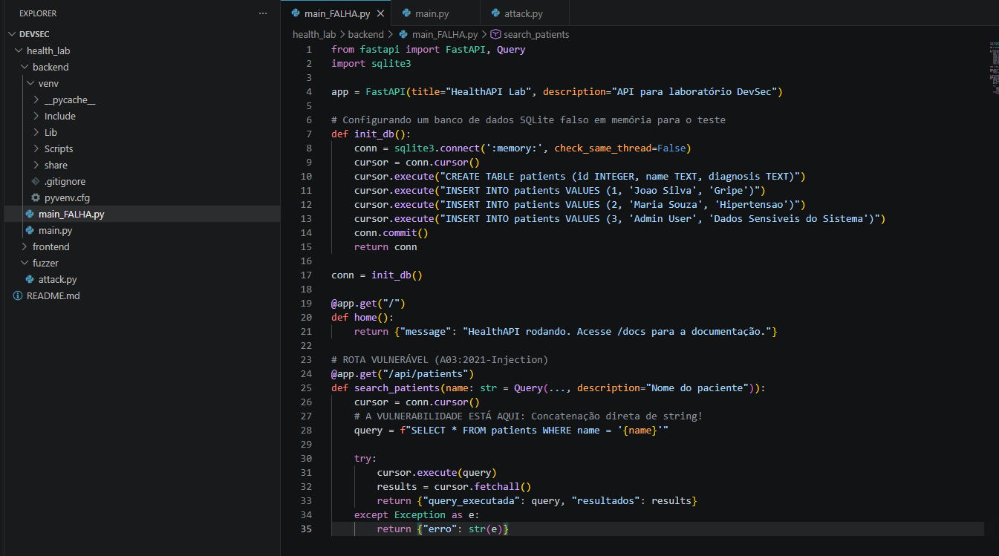
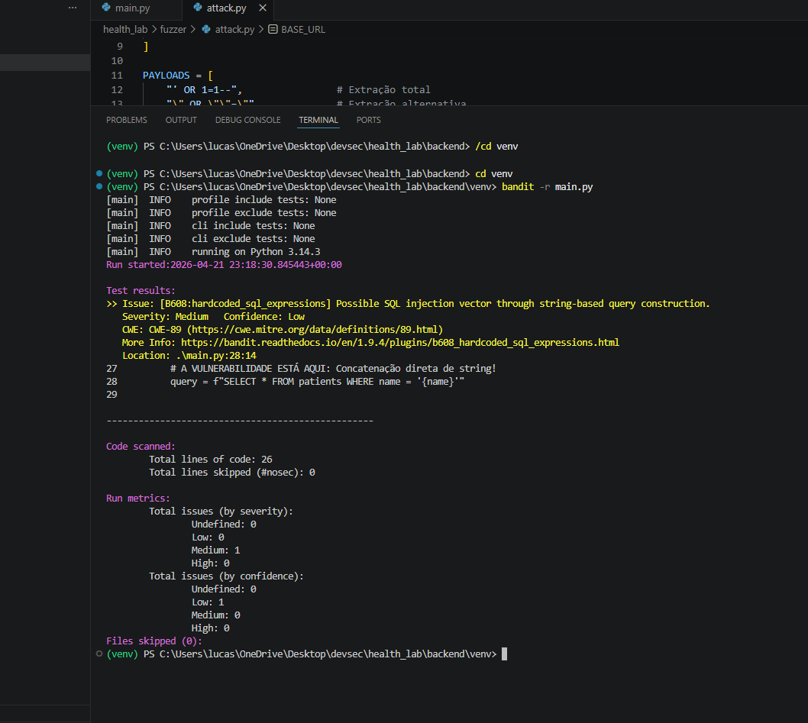
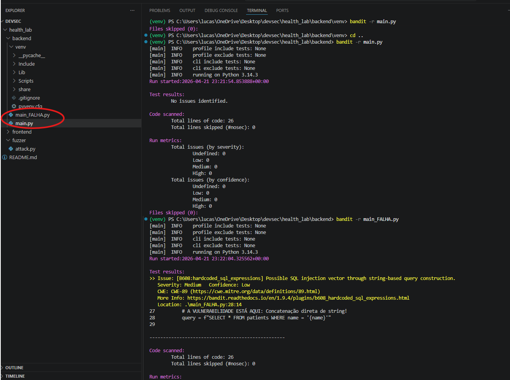
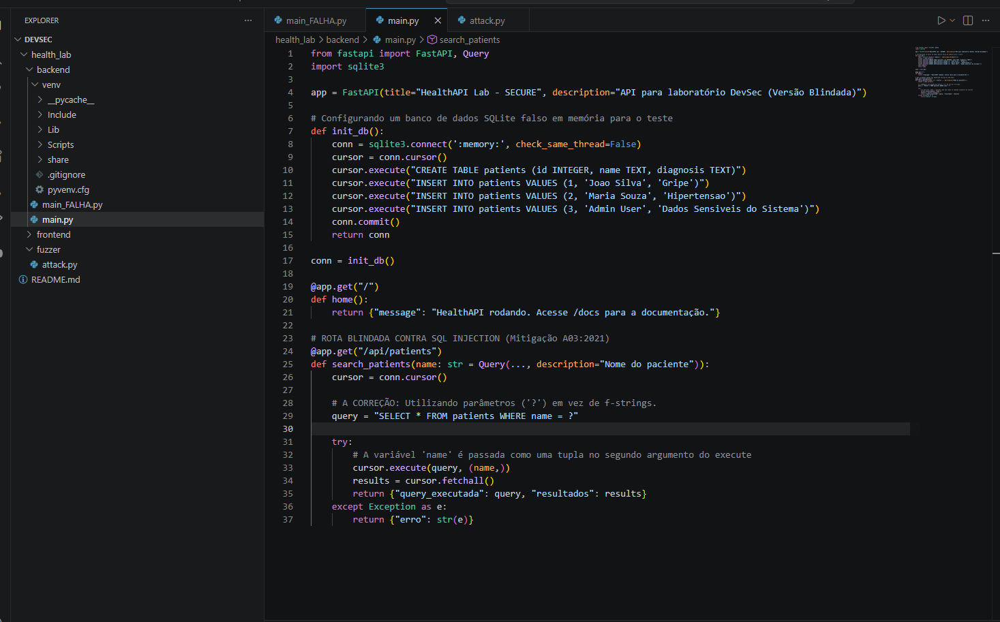
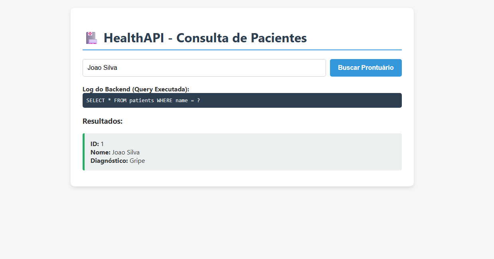
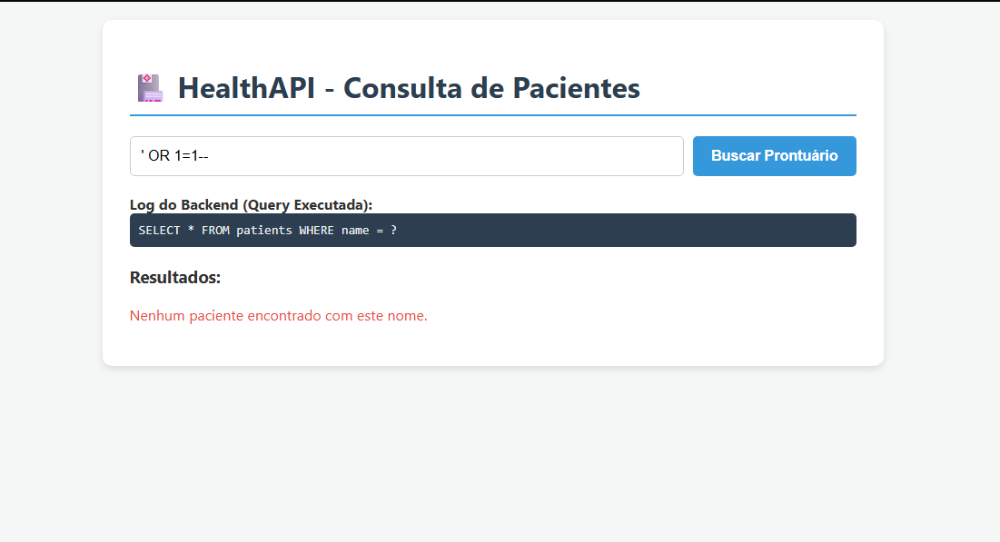
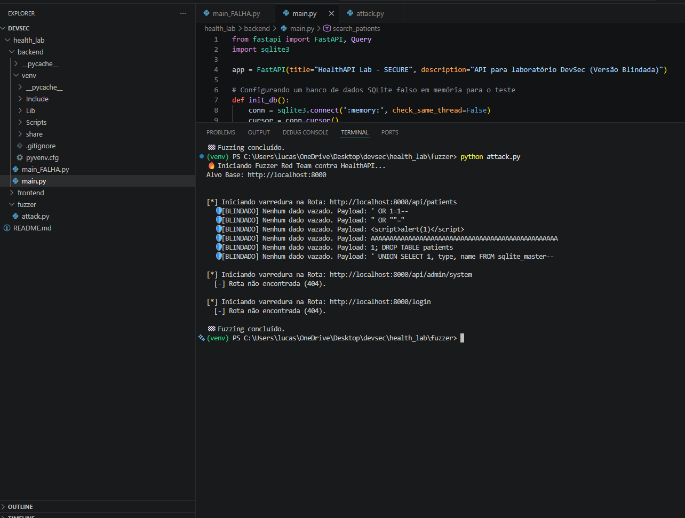

# 🛡️ HealthAPI DevSecOps Lab: Fuzzer, SAST & Secure Coding
**Autor:** Lucas Carvalho  
**Área:** Application Security / DevSecOps  
**Status:** Concluído  

## 1. Visão Geral do Projeto
Este projeto consiste na criação de um laboratório de desenvolvimento seguro (AppSec) simulando uma aplicação real da área da saúde (Gestão de Prontuários). O objetivo foi demonstrar o ciclo de vida completo do DevSecOps: desde a construção de uma API vulnerável, passando pela automação de ataques ofensivos (Fuzzing), até a detecção automatizada de falhas no código-fonte (SAST) e a implementação da correção definitiva (Secure Coding).

O laboratório ilustra como uma falha simples pode levar ao vazamento de dados sensíveis (LGPD) e como ferramentas de automação evitam que o código inseguro chegue ao ambiente de produção.

---

## 2. Topologia e Stack Tecnológica
A arquitetura simula um ambiente moderno de desenvolvimento web (Full-Stack), integrado localmente para testes de segurança.

* **Backend (API):** Desenvolvido em **Python** com o framework **FastAPI**. Responsável pela lógica de negócio e persistência de dados.
* **Frontend (Interface):** Interface web (HTML/JS) que consome a API, simulando o ponto de entrada do usuário final.
* **Banco de Dados:** **SQLite** em memória, utilizado para demonstrar ataques de extração de dados.
* **Ferramentas de Segurança:**
    * **Bandit (SAST):** Ferramenta de análise estática de segurança que escaneia o código Python em busca de vulnerabilidades.
    * **Custom Fuzzer (Red Team):** Script desenvolvido em Python para automação de ataques e descoberta de endpoints.

---

## 3. Emulação de Ataques (Red Team)

### **O IMPACTO - Explorando SQL Injection (OWASP A03)**
**Como uma busca inocente vaza dados críticos do sistema**

O teste inicial demonstra a vulnerabilidade na prática. O erro crítico ocorreu porque a API utilizava **concatenação de strings** para montar as consultas ao banco de dados. Isso permitiu que comandos SQL maliciosos fossem injetados através de campos de busca comuns.

* **O Ataque:** Ao inserir o payload `' OR 1=1--`, a lógica do banco é alterada para retornar todos os registros da tabela, ignorando filtros de segurança.

*Resultado: Exposição de dados de pacientes e contas administrativas (Admin User).*

### **A AUTOMAÇÃO - Fuzzer de Múltiplos Alvos**
Para simular um ataque real e escalável, desenvolvi um script **Fuzzer em Python**. Este "robô" automatiza o teste de múltiplos endpoints simultaneamente com uma lista de diversos payloads maliciosos, permitindo inclusive a descoberta da estrutura interna do banco de dados (`sqlite_master`).

*O Fuzzer confirma a exploração bem-sucedida e a extração automatizada de registros.*

---

## 4. Engenharia de Detecção no Código (AppSec/SAST)

### **A DETECÇÃO - O Raio-X com Bandit**
**Simulando um Pipeline CI/CD que bloqueia falhas na origem**

Em um fluxo de DevSecOps, o foco é o **Shift-Left Security** (trazer a segurança para o início do desenvolvimento). Utilizamos o **Bandit** para realizar o SAST (Static Application Security Testing).

* **O que o Bandit faz?** Ele analisa o código-fonte em busca de padrões inseguros antes mesmo do código ser executado. No laboratório, ele identificou imediatamente a vulnerabilidade de SQL Injection no arquivo `main_FALHA.py`.

*O Bandit aponta a falha estrutural (CWE-89) na linha exata da concatenação.*

*Comparativo: O Bandit validando o código limpo e acusando erro no código sujo.*

---

## 5. Mitigação e Defesa (Blue Team)

### **A CORREÇÃO - Implementando Prepared Statements**
A correção definitiva não foi um firewall externo, mas sim a refatoração do código seguindo padrões de **Secure Coding**. 

O arquivo `main.py` foi corrigido utilizando **Parâmetros de Consulta (`?`)**.
* **A Defesa:** Com essa prática, o banco de dados é instruído a tratar qualquer entrada do usuário estritamente como um dado (texto), neutralizando qualquer tentativa de execução de comando malicioso.

---

## 6. Validação Final (DevSecOps)

### **RE-TESTE - Comprovando a Resiliência**
Após a mitigação, o ambiente foi submetido a uma nova bateria de testes para confirmar o sucesso da blindagem.

1.  **Busca Legítima:** O sistema continua funcional para usuários reais.
    
2.  **Tentativa de Injeção na Web:** A interface agora bloqueia o ataque, protegendo os dados.
    
3.  **Fuzzer vs Defesa:** O arsenal ofensivo agora é totalmente neutralizado pela parametrização, classificando todas as tentativas como `[BLINDADO]`.
    

---

## 7. Conclusão e Resultados
A execução deste laboratório comprova a eficácia de uma estratégia de defesa em camadas:
1.  **Visibilidade:** Entender como o atacante pensa (Fuzzing) é essencial para priorizar defesas.
2.  **Automação:** Ferramentas de SAST (Bandit) reduzem drasticamente o erro humano e o custo de correção.
3.  **Padronização:** Práticas de Secure Coding (Prepared Statements) resolvem falhas críticas na raiz, tornando a aplicação resiliente "by design".